Here is a professional, engaging, and highly structured README.md file designed to make your GitHub repository stand out.

You can copy this directly into your project.

code
Markdown
download
content_copy
expand_less
# ⚡ GCP Real-Time Financial Data Pipeline

> **A scalable, event-driven architecture capturing Bitcoin, Ethereum, and Gold market data in real-time.**

---

## 📖 Project Overview

This project is not just a data scraper; it is a fully automated **Cloud Data Engineering Pipeline**. It demonstrates the lifecycle of financial data—from extraction to visualization—using a modern **Google Cloud Platform (GCP)** infrastructure.

By leveraging **Serverless Computing**, **Streaming Protocols**, and **Data Lakes**, this system solves the challenge of handling high-frequency market data with fault tolerance and scalability.

### 🎯 Key Objectives
*   **Ingestion:** Harvest live OHLCV (Open, High, Low, Close, Volume) data every minute.
*   **Decoupling:** Use Message Queues to ensure data is never lost, even if the processing layer fails.
*   **Data Lake:** Implement a "Raw" vs. "Curated" storage strategy for historical auditing.
*   **Visualization:** Provide a live, interactive dashboard for trend analysis.

---

## 🏗️ Cloud Architecture

The system follows a linear DAG (Directed Acyclic Graph) workflow, moving data from ingestion to insight.

```mermaid
flowchart LR
  subgraph Google_Cloud_Platform["Google Cloud Platform"]
        B["Compute Engine VM<br>FastAPI Ingestion Service"]
        C["Pub/Sub Topic<br>Market Data Streaming"]
        D["Consumer Workers<br>Compute Engine VM"]
        E["GCS RAW Zone<br>Raw JSON Market Data"]
        F["ETL Processing<br>PySpark / Python"]
        G["GCS CURATED Zone<br>BTC • ETH • GOLD CSVs"]
        H["Cloud Run<br>Serverless Streamlit Dashboard"]
  end
    A["GCP Project Initialization<br>IAM • APIs • Networking"] --> B
    B --> C
    C --> D
    D --> E
    E --> F
    F --> G
    G --> H

    style Google_Cloud_Platform stroke:#FFD600,fill:#FFF9C4  mermaid
```

🛠️ Technology Stack

This project uses a "Best Tool for the Job" approach:

Component	Service / Tool	Description
Ingestion	GCP Compute Engine	Hosts a persistent FastAPI producer that queries Yahoo Finance on a cron schedule.
Streaming	Cloud Pub/Sub	Acts as the async message broker, buffering events to handle throughput spikes.
Storage	Cloud Storage (GCS)	Object storage acting as the Data Lake. Divided into buckets/raw (JSON) and buckets/curated (CSV).
ETL	PySpark / Python	Cleanses data, handles null values in crypto feeds, and dedupes records.
Frontend	Cloud Run	Hosts the Streamlit dashboard in a serverless container, auto-scaling based on traffic.
🚀 How It Works (The Pipeline)

The Trigger: A Python script on the VM wakes up every 60 seconds.

The Fetch: It requests the latest 1-minute candle for BTC-USD, ETH-USD, and GC=F (Gold).

The Stream: Data is serialized to JSON and pushed to a Pub/Sub Topic.

The Sink: A subscriber worker pulls the message and writes it to the Raw Data Zone (GCS).

The Transform: An ETL process picks up raw files, flattens the JSON, fixes timestamps, and writes clean rows to the Curated Zone.

The View: The Streamlit App (running on Cloud Run) reads the Curated CSVs and updates the charts in real-time.

⚠️ Live Environment & Access Policy

This project is currently deployed and active.

Because the infrastructure (VMs, Cloud Run instances) incurs real-time costs and handles live data connections, the repository configurations (API Keys, Service Account JSONs) are private.

Note for Recruiters & Developers:
If you wish to demo the live dashboard or review the underlying source code for educational purposes, please contact the repository owner directly.

Status: 🟢 Online

🔮 Future Roadmap

Machine Learning Integration: Connect Google BigQuery ML to predict the next hour's closing price.

Alerting: Use Cloud Monitoring to send emails when Bitcoin drops by >5%.

📬 Contact

Developer: [Your Name]
Focus: Data Engineering, Cloud Architecture, Real-Time Systems

code
Code
download
content_copy
expand_less
